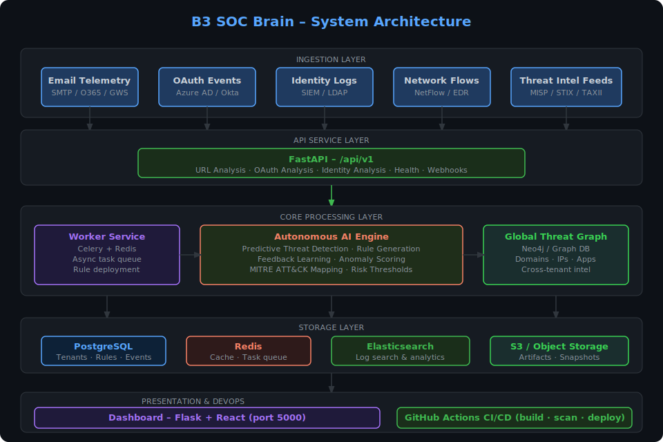

# B3 SOC Brain – Autonomous Cyber Defense SaaS

**Version:** 1.0.0
**Author:** B3 Cybersecurity Operations Team
**License:** MIT

---

## 🚀 Overview

B3 SOC Brain is a **multi-tenant, fully autonomous Security Operations Center (SOC) platform**. It combines:

- **Predictive threat detection** (phishing, OAuth abuse, identity anomalies)
- **Autonomous rule generation** for enterprise SOCs
- **Global Threat Graph** intelligence for cross-tenant insights
- **Real-time dashboards** for monitoring and analytics
- **CI/CD deployment pipelines** for fast rollout

The platform is production-ready and deployable **on Kubernetes** or locally with Docker Compose.

---

## 🧠 Architecture



Key components:

1. **API Service** – FastAPI endpoints for URL, OAuth, and user activity analysis
2. **Worker Service** – Background tasks running autonomous AI modules
3. **Autonomous AI** – Predictive and adaptive engines for rule generation and feedback learning
4. **Dashboard** – Flask + React interface for real-time SOC visualization
5. **Global Threat Graph** – Graph database of domains, IPs, OAuth apps, and attack patterns
6. **CI/CD Pipelines** – GitHub Actions for build, test, security scans, staging and production deployments

See the full [Architecture Diagram](docs/b3_soc_brain_architecture.svg), [SOC Workflow Diagram](docs/soc_workflow_diagram.svg), and [Autonomous AI Flowchart](docs/autonomous_ai_flowchart.svg) in the `docs/` folder.

---

## 🗂 Repository Structure

```text
b3-soc-brain/
├── .github/workflows/          # CI/CD workflows
├── deployment/k8s/             # Kubernetes manifests
├── deployment/helm/            # Helm chart for production
├── docker/                     # Dockerfiles for API and Worker
├── scripts/                    # Deployment, linting, tagging scripts
├── src/                        # API, Worker, Autonomous AI modules, Dashboard
├── migrations/                 # Database migration scripts
├── docs/                       # Architecture, workflow, and AI diagrams
├── .env                        # Environment variables
├── docker-compose.override.yml
├── requirements.txt
├── Makefile
├── README.md
└── LICENSE
```

---

## ⚙️ Features

### 1. Predictive Threat Detection

- Phishing URL scoring
- OAuth app permission abuse detection
- Suspicious login and identity anomaly detection

### 2. Autonomous SOC Rule Engine

- Automatic rule generation for phishing, OAuth, and identity threats
- Real-time deployment to endpoints and email gateways
- Continuous feedback loop to improve detection accuracy

### 3. Multi-Tenant SaaS Support

- Isolated tenant environments
- Global Threat Graph correlations across tenants
- Configurable per-tenant risk thresholds

### 4. Dashboard

- Real-time visualization of threats, rules, and tenant metrics
- Alerts for malicious activity
- OAuth abuse notifications

### 5. CI/CD & DevOps

- Automated build, test, and deployment workflows
- Security scanning (Trivy + Bandit)
- Versioning and GitHub Releases

---

## 🛠 Deployment

### Local Development (Docker Compose)

```bash
cp .env .env.local
docker-compose -f docker-compose.override.yml up --build
```

- Access dashboard: <http://localhost:5000>
- API endpoints: <http://localhost:8000/api/v1>

---

### Kubernetes Deployment

1. Create namespace:

   ```bash
   kubectl create namespace b3-soc-brain
   ```

2. Deploy secrets:

   ```bash
   kubectl apply -f deployment/k8s/secrets-example.yml
   ```

3. Deploy Helm chart:

   ```bash
   helm install b3-soc-brain deployment/helm/ -n b3-soc-brain
   ```

4. Monitor pods:

   ```bash
   kubectl get pods -n b3-soc-brain
   kubectl logs -f <api-pod-name> -n b3-soc-brain
   ```

5. Access dashboard via LoadBalancer or Ingress.

---

## 📦 CI/CD Pipelines

| Workflow | Purpose |
|---|---|
| `build.yml` | Build, test, and Docker image push |
| `deploy-staging.yml` | Automatic staging deployment |
| `deploy-production.yml` | Manual production deployment with rollout checks |
| `security-scan.yml` | Static analysis + container scans |
| `release.yml` | Semantic version tagging and GitHub Releases |

---

## 🔒 Security & Secrets

- `.env` file holds environment variables
- `deployment/k8s/secrets-example.yml` for Kubernetes secrets (base64 encoded)
- Use strong passwords and keys for production
- All secrets are read by API and Worker services via environment variables

---

## 🧰 Development Workflow

1. Create a feature branch:

   ```bash
   git checkout -b feature/my-feature
   ```

2. Run pre-commit checks:

   ```bash
   ./scripts/precommit.sh
   ```

3. Run tests:

   ```bash
   make test
   ```

4. Build and push Docker images:

   ```bash
   make build
   make push
   ```

5. Deploy to staging for validation:

   ```bash
   make deploy-staging
   ```

6. Merge to main and deploy to production:

   ```bash
   make deploy-prod
   ```

---

## 📈 Metrics & Monitoring

Key KPIs tracked by Autonomous AI:

| Metric | Target |
|---|---|
| Mean detection time | < 10s |
| Automated containment | > 95% |
| False positives | < 3% |
| Tenant coverage | 100% |

---

## 📖 References

- [11 Strategies of a World-Class SOC](https://www.sans.org/white-papers/11-strategies-world-class-cybersecurity-operations-center/)
- [MITRE ATT&CK Framework](https://attack.mitre.org/)
- [Zero Trust Principles (NIST SP 800-207)](https://csrc.nist.gov/publications/detail/sp/800-207/final)

---

## ⚡ License

MIT License – see [LICENSE](LICENSE) for details.
